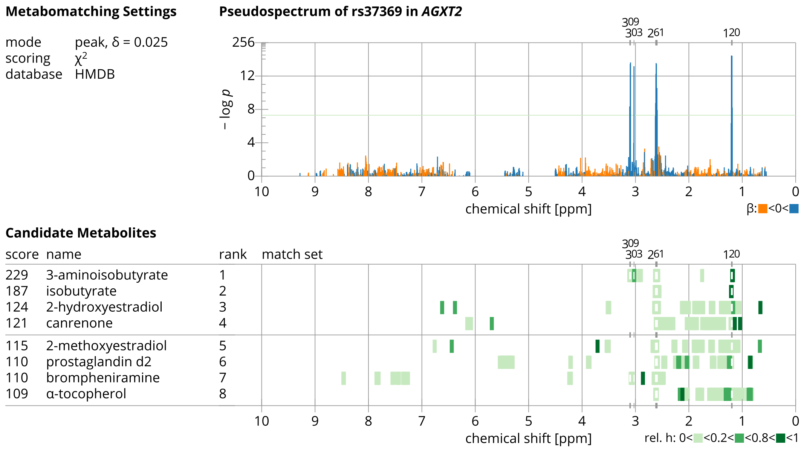

# metabomatching
Version: 0.1.0

## Short description
metabomatching identifies metabolites using genetic spiking.

## Description
metabomatching identifies metabolites using genetic spiking.

## Key features
- metabolite identification
- NMR spectroscopy

## Functionality
- Annotation NMR
- Statistical Analysis

## Approaches
- Metabolomics Untargeted

## Instrument Data Types
- NMR / 1H NMR

## Screenshots
<<<<<<< HEAD

Sample metabomatching figure.
=======

>>>>>>> develop

## Tool Authors
- Rico Rueedi (University of Lausanne)

## Container Contributors
- Rico Rueedi (University of Lausanne)

## Website
- http://www.unil.ch/cbg/index.php?title=metabomatching

## Git Repository
- https://github.com/phnmnl/container-metabomatching

## Installation
metabomatching is present on all PhenoMeNal Galaxy instances on deployed Cloud Research Environments, under the NMR category in the tool bar to the left of the screen. No installation is needed hence on PhenoMeNal Cloud Research Environments.

## Usage Instructions
On a PhenoMeNal Cloud Research Environment Galaxy environment, go to NMR category, then click on metabomatching. Provide the association statistics dataset (the pseudospectra) and parameters as .tsv files, then run. More detailed instructions figure on the tool page.
